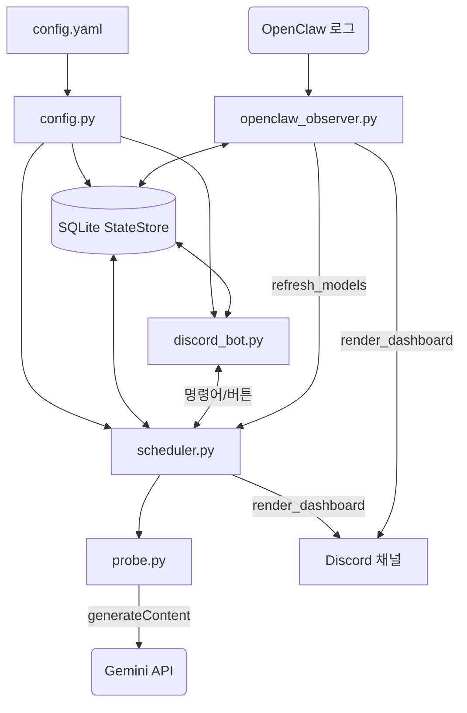

# Gemini API Monitoring Discord Bot

여러 개의 Google Gemini API 키와 모델 조합의 **실제 생성 요청 가능 상태**를 주기적으로 점검하고, 결과를 디스코드 채널의 고정 대시보드 메시지 하나로 보여주는 모니터링 봇입니다. 관리자는 슬래시 명령어와 대시보드 버튼으로 키·모델을 관리하고 즉시 재확인을 실행할 수 있습니다.

각 확인은 `generateContent` API에 매우 짧은 입력(`ping`)과 `maxOutputTokens: 1`을 보내 수행합니다. 단순 토큰 계산이 아니라 **해당 키로 해당 모델의 생성 요청이 현재 통과하는지**를 직접 확인하는 방식이며, 이 요청 자체도 Gemini 사용량/할당량에 영향을 줄 수 있으므로 봇은 요청을 한 번에 하나씩만 순차 실행합니다.

> 이 프로젝트는 Gemini API 사용 가능 여부를 보조적으로 관측하는 도구입니다. Google Console의 사용량/할당량 정보나 서비스 상태 페이지를 대체하지 않습니다.

> **설치 방식을 먼저 정하세요**: 그냥 잠깐 켜서 동작만 확인해 볼 거라면 [빠른 시작: 로컬 실행](#빠른-시작-로컬-실행)으로 충분합니다. 하지만 **컴퓨터(서버)를 껐다 켜도 봇이 알아서 다시 실행되게** 하려면 터미널에서 `python main.py`로 직접 띄우는 방식으로는 안 되고, [Ubuntu/systemd 운영](#ubuntusystemd-운영) 섹션을 따라 시스템 서비스로 등록해야 합니다. 이 방식은 프로젝트 파일을 `/opt/` 아래에 두는 것을 전제로 합니다.

## 목차

- [주요 기능](#주요-기능)
- [아키텍처](#아키텍처)
- [동작 방식](#동작-방식)
- [상태 아이콘과 재확인 규칙](#상태-아이콘과-재확인-규칙)
- [준비물과 Discord 권한](#준비물과-discord-권한)
- [빠른 시작: 로컬 실행](#빠른-시작-로컬-실행)
- [설정 파일](#설정-파일)
- [대시보드와 조작 방법](#대시보드와-조작-방법)
- [슬래시 명령어](#슬래시-명령어)
- [Ubuntu/systemd 운영](#ubuntusystemd-운영)
- [OpenClaw 로그 관찰기](#openclaw-로그-관찰기)
- [저장 데이터와 보안 유의사항](#저장-데이터와-보안-유의사항)
- [문제 해결](#문제-해결)
- [현재 구현 범위와 추후 검토 항목](#현재-구현-범위와-추후-검토-항목)
- [개발 및 테스트](#개발-및-테스트)

## 주요 기능

- **키 × 모델 매트릭스 자동 관리**: 키나 모델을 추가하면 모든 조합이 상태 테이블에 자동으로 채워지고, 조합별로 상태를 개별 추적합니다.
- **저비용 프로브**: `generateContent`에 최소 요청("ping")을 보내 실제 사용량에 거의 영향을 주지 않으면서 사용 가능 여부만 확인합니다(요청당 20초 타임아웃).
- **순차·스태거 실행**: 모든 프로브는 하나의 잠금으로 한 번에 하나씩만 실행되고, 요청 사이에 `probe_stagger_sec`만큼 간격을 둡니다. 동일한 작업(예: "전체 재확인")이 이미 진행 중이면 중복 실행되지 않습니다.
- **자동 재확인 + 시간 기반 정리**: `active_probe_interval_min` 주기로 재확인 대기 중이거나 한 번도 확인되지 않았거나 `stale_after_min`보다 오래된 조합을 우선순위대로 재확인합니다. 더 짧은 `reconcile_interval_sec` 주기로는 네트워크 호출 없이, 한도 초과(`limited`) 상태의 `reset_at` 시각이 지나면 "미확인 + 재확인 대기"로 되돌리고 오래된 OpenClaw 이벤트를 정리합니다.
- **429 응답 상세 해석**: Google 응답의 `QuotaFailure`(quotaId, model)와 `RetryInfo`(retryDelay)를 파싱합니다. 실제 대기 시간은 Google이 알려준 값과 관리자가 설정한 최소 쿨다운(`/config cooldown`, 기본 1800초 = 30분) 중 **더 긴 쪽**을 사용합니다.
- **고정 대시보드 임베드**: 채널에 메시지 하나만 유지하며 내용이 바뀔 때만 수정합니다(변화가 없으면 API 호출 자체를 하지 않음). 모델(행) × 키(열) 상태를 이모지 그리드로 보여주고, 관리자 전용 버튼(전체 재확인/작업 상태/RESET)이 붙어 있습니다.
- **OpenClaw 실사용 감지 (선택 기능)**: 외부 프로세스의 로그를 구독해 `provider=google` 관련 429·과부하·타임아웃을 감지하면, 그 자체로 상태를 바꾸지 않고 해당 모델의 재확인만 우선 예약합니다. 최종 상태는 항상 직접 프로브 결과로만 결정됩니다.
- **키 암호화 저장**: API 키는 Fernet으로 암호화되어 SQLite에 저장되며, SHA-256 지문으로 동일한 키 값의 중복 등록을 막습니다.
- **관리자 전용 · 최소 권한**: 모든 슬래시 명령어와 대시보드 버튼은 `admin_user_ids`에 속한 사용자만 사용할 수 있습니다. 봇은 `discord.Intents.none()`으로 동작해 슬래시 명령/버튼 상호작용만 쓰므로 메시지 콘텐츠 같은 별도 인텐트를 켤 필요가 없습니다.

## 아키텍처



| 파일 | 역할 |
| --- | --- |
| `main.py` | 설정 로드 → `StateStore` → `MonitorBot` → `ProbeScheduler` 연결 → (옵션) `OpenClawObserver` 실행 → 봇 시작. `active_loop`, `reconcile_loop`를 백그라운드 태스크로 실행합니다. |
| `config.py` | `config.yaml`을 읽고 `${ENV_VAR}` 문자열을 환경변수로 치환하며, 필수값과 형식(모델은 `google/` 접두사, ID/모델 중복 금지, `admin_user_ids` 최소 1개 등)을 검증합니다. |
| `models.py` | `ApiKey`, `ProbeResult`, 상태 타입 `Status`(`ok`/`limited`/`invalid`/`unknown`/`checking`)를 정의합니다. |
| `database.py` | SQLite 상태 저장소(`StateStore`). 암호화된 키, 모델, 프로브 상태 매트릭스, 앱 상태(대시보드 메시지 ID 등), OpenClaw 이벤트를 관리합니다. |
| `probe.py` | Gemini `generateContent` 호출과 응답 해석(상태 판정, 429 상세 파싱)을 담당합니다. |
| `scheduler.py` | 프로브 실행 시점·순서를 조율합니다(직렬 실행, 스태거링, 중복 방지, 취소/리셋). |
| `discord_bot.py` | 디스코드 클라이언트, 대시보드 임베드, 슬래시 명령어, 버튼 UI. |
| `openclaw_observer.py` | (선택) 외부 OpenClaw 로그를 구독해 실사용 오류를 보조 신호로 반영합니다. |
| `deploy/gemini-api-monitor.service` | systemd 서비스 유닛 예시. |
| `tests/` | pytest 단위 테스트 (설정 검증, 대시보드 포맷, DB 상태 전이, 프로브 파싱, 스케줄러 동시성, OpenClaw 파서). |

## 동작 방식

### 키와 모델의 실행 순서

전체 재확인은 다음처럼 **키 하나에 연결된 모델을 차례대로** 확인합니다.

```text
키 A → 모델 1 → 모델 2 → 모델 3
키 B → 모델 1 → 모델 2 → 모델 3
```

동시에 여러 Gemini 요청을 보내지 않습니다. 프로브 작업은 하나의 락으로 직렬화되며, 각 요청 사이에는 `probe_stagger_sec`만큼 대기할 수 있습니다.

### 자동 확인

- 시작 후 아직 한 번도 확인하지 않은 조합은 자동 확인 대상입니다.
- 마지막 확인 시각이 `stale_after_min`보다 오래된 조합도 자동 확인 대상입니다.
- 자동 확인 루프는 `active_probe_interval_min` 간격으로 실행됩니다.
- `limited` 상태는 `reset_at` 시간이 지나면 ⚪ 재확인 대기 상태가 됩니다. 실제 요청이 성공해야만 🟢으로 바뀝니다.

### 중복 및 RESET

전체 재확인이 이미 진행 또는 대기 중이면 새 전체 재확인 요청은 거부되고 안내 메시지만 표시됩니다. 같은 작업이 계속 쌓여 API 사용량이 증가하는 것을 막기 위한 정책입니다.

RESET은 현재 실행 중인 작업뿐 아니라 락을 기다리는 작업까지 취소합니다. 취소 시점에 🔵로 남아 있던 항목은 모두 ⚪로 되돌립니다. 자동 모니터링 루프 자체는 종료하지 않으므로, 다음 자동 확인 주기에는 정상적으로 다시 동작합니다.

## 상태 아이콘과 재확인 규칙

| 아이콘 | 상태 | 의미와 다음 동작 |
| --- | --- | --- |
| 🟢 | `ok` | 최근 생성 요청이 성공했습니다(HTTP 200). |
| 🔴 | `limited` | Gemini가 HTTP 429를 반환했습니다. 쿨다운이 지나면 ⚪ 재확인 대기로 바뀝니다. |
| ⚠️ | `invalid` | HTTP 401/403/404를 받았습니다. API 키, 권한, 모델 이름을 확인하세요. |
| ⚪ | `unknown` | 아직 확인하지 않았거나, 네트워크/일시 오류(요청당 20초 타임아웃)가 있었거나, 재확인 대기입니다. |
| 🔵 | `checking` | 현재 해당 조합을 확인하고 있습니다. RESET 시 ⚪로 되돌아갑니다. |

임베드 색상은 **전체가 `ok`면 초록**, **하나라도 `limited`/`invalid`가 있으면 빨강**, 그 외(미확인 포함)는 **주황**입니다. 429 응답에 Google의 재시도 시간이 포함되어도, 현재 구현은 서버 값과 기본 쿨다운 중 더 긴 시간을 사용합니다 — 짧은 시간 안에 재확인을 반복해 제한을 악화시키지 않기 위한 보수적 정책입니다. 대시보드 하단 푸터에는 "키 순서"(번호 ↔ 키 ID 매핑)와 아이콘 범례가 함께 표시됩니다.

## 준비물과 Discord 권한

### 준비물

1. Python 3.11 이상 (`datetime.UTC` 사용)
2. Discord 봇 토큰
3. 대시보드를 보낼 Discord 채널 ID
4. 관리자의 Discord 사용자 ID 한 개 이상
5. Google API 키 한 개 이상
6. API 키 저장용 Fernet 암호화 키

### Discord 봇 초대

Discord Developer Portal에서 봇을 초대할 때 아래를 선택합니다.

- **Scopes**: `bot`, `applications.commands`
- **Bot Permissions**: `View Channel`, `Send Messages`, `Embed Links`, `Read Message History`

`Read Message History` 권한이 없으면 기존 대시보드 메시지를 찾지 못해 새 메시지가 만들어질 수 있습니다.

## 빠른 시작: 로컬 실행

> 아래 방법은 **동작을 빠르게 확인해보기 위한 테스트 실행**입니다. 터미널을 닫거나 컴퓨터를 재부팅하면 봇도 함께 멈춥니다. 재부팅 후에도 자동으로 다시 켜지는 상시 운영이 필요하다면 이 섹션은 건너뛰고 바로 [Ubuntu/systemd 운영](#ubuntusystemd-운영)을 따라가세요.

### 1. 프로젝트 받기

```bash
git clone <저장소_URL> gemini-api-monitoring-discord-bot
cd gemini-api-monitoring-discord-bot
```

### 2. 가상환경과 의존성 설치

Ubuntu/Debian 예시입니다.

```bash
sudo apt update
sudo apt install -y python3 python3-venv python3-pip

python3 -m venv .venv
. .venv/bin/activate
pip install -r requirements.txt
```

의존성(`requirements.txt`): `aiohttp`, `discord.py`, `cryptography`, `PyYAML`

### 3. 설정 파일 만들기

```bash
cp config.example.yaml config.yaml
```

`config.yaml`에서 최소한 아래 값을 수정합니다.

```yaml
discord:
  bot_token: "${DISCORD_BOT_TOKEN}"
  channel_id: "대시보드를_보낼_채널_ID"

security:
  admin_user_ids: ["본인_Discord_사용자_ID"]
  encryption_key_env: "KEY_ENCRYPTION_SECRET"
```

`security.admin_user_ids`는 비워 둘 수 없습니다. 비어 있거나 누락되면 봇은 시작하지 않습니다. 관리자 ID가 없는 상태에서 누구나 관리 기능을 쓰게 되는 실수를 막기 위한 정책입니다.

### 4. 비밀값 설정

Fernet 키를 한 번 생성합니다.

```bash
python -c 'from cryptography.fernet import Fernet; print(Fernet.generate_key().decode())'
```

출력된 값을 사용해 현재 셸에 환경 변수를 설정합니다.

```bash
export KEY_ENCRYPTION_SECRET='생성한_Fernet_키'
export DISCORD_BOT_TOKEN='Discord_봇_토큰'
```

> `KEY_ENCRYPTION_SECRET`을 잃거나 변경하면 기존 SQLite DB에 암호화되어 저장된 API 키를 읽을 수 없습니다. 안전한 비밀 저장소에 백업하세요.

### 5. 실행

```bash
python main.py
```

대상 Discord 채널에 대시보드가 나타나면 성공입니다. 처음에는 키/모델이 없거나 확인 전이라 ⚪ 상태가 보일 수 있습니다.

### 6. 첫 API 키 추가와 확인

Discord에서 관리자 계정으로 실행합니다.

```text
/key add id:main value:Google_API_키
```

대시보드의 **전체 재확인** 버튼을 누르거나 다음을 실행합니다.

```text
/refresh
```

## 설정 파일

전체 예시는 [`config.example.yaml`](config.example.yaml)을 참고하세요.

```yaml
discord:
  bot_token: "${DISCORD_BOT_TOKEN}"
  channel_id: "123456789012345678"

security:
  admin_user_ids: ["123456789012345678"]
  encryption_key_env: "KEY_ENCRYPTION_SECRET"

schedule:
  reconcile_interval_sec: 90
  active_probe_interval_min: 20
  probe_stagger_sec: 3
  stale_after_min: 30

openclaw_observer:
  enabled: false
  command: ["openclaw", "logs", "--follow"]
  restart_delay_sec: 10
  event_cooldown_sec: 60

api_keys: []
models:
  - "google/gemini-3.7-flash"
```

| 설정 | 의미 | 기본값 |
| --- | --- | --- |
| `discord.bot_token` | Discord 봇 토큰 | 필수 |
| `discord.channel_id` | 대시보드 채널 ID | 필수 |
| `security.admin_user_ids` | 관리 명령/버튼을 쓸 Discord 사용자 ID 목록 | 필수, 비어 있으면 시작 실패 |
| `security.encryption_key_env` | Fernet 키를 읽을 환경 변수 이름 | `KEY_ENCRYPTION_SECRET` |
| `schedule.reconcile_interval_sec` | 제한 만료와 오래된 OpenClaw 알림 정리 주기 | `90`초 |
| `schedule.active_probe_interval_min` | 자동 프로브 루프 주기 | `20`분 |
| `schedule.probe_stagger_sec` | 같은 작업 안에서 다음 API 요청 전 대기 | `3`초 |
| `schedule.stale_after_min` | 마지막 확인 뒤 자동 재확인 대상으로 보는 시간 | `30`분 |
| `openclaw_observer.enabled` | OpenClaw 로그 관찰기 사용 여부 | `false` |
| `openclaw_observer.event_cooldown_sec` | 같은 모델/이벤트 로그를 다시 처리하기 전 대기 | `60`초 |

문자열 값 안의 `${ENV_VAR}` 표기는 해당 환경 변수 값으로 치환됩니다.

> **참고**: `config.yaml`의 `api_keys`/`models`는 봇을 시작할 때마다 다시 시딩됩니다. 이미 등록된 항목은 조용히 건너뛰므로 재시작 자체는 안전하지만, `/key remove`나 `/model remove`로 지운 항목이 설정 파일에 여전히 남아 있으면 재시작 시 다시 추가됩니다. 완전히 제거하려면 `config.yaml`에서도 해당 항목을 삭제해야 합니다.

## 대시보드와 조작 방법

대시보드에는 모델별로 키 상태가 왼쪽부터 등록 순서대로 표시됩니다.

```text
Gemini 3.6 Flash   🟢🔴⚪
Gemini 3.5 Flash   🟢🟢🟢
```

### 대시보드 버튼

모든 버튼은 관리자만 사용할 수 있으며, 응답은 누른 사람에게만 보입니다.

| 버튼 | 동작 |
| --- | --- |
| **전체 재확인** | 모든 키×모델 조합을 순차적으로 다시 확인합니다. 이미 동일 작업이 있으면 중복 실행하지 않습니다. |
| **작업 상태** | 실행 중/대기 중인 작업 출처와 `완료 수/전체 수`를 표시합니다. |
| **RESET** | 실행 및 대기 프로브를 전부 취소하고 🔵 상태를 ⚪로 초기화합니다. |

버튼은 persistent view로 등록되므로 봇을 재시작해도 대시보드가 다시 렌더링되면 동일한 버튼을 계속 사용할 수 있습니다.

## 슬래시 명령어

키·모델 관리처럼 입력값이 필요한 기능은 슬래시 명령어로 제공합니다. 모든 명령어는 관리자 전용이며, 봇 시작 시(`on_ready`)에 자동으로 등록·동기화됩니다.

| 명령어 | 설명 |
| --- | --- |
| `/key add id:<이름> value:<API 키>` | API 키를 추가합니다. 키 ID 또는 실제 키 값이 이미 등록되어 있으면 거부됩니다. |
| `/key remove id:<이름>` | API 키와 해당 상태 행을 삭제합니다. |
| `/key list` | 키 값이 아닌 등록된 키 ID만 표시합니다. |
| `/model add name:google/<모델명>` | 확인할 모델을 추가합니다. 모델명은 반드시 `google/`로 시작해야 합니다. |
| `/model remove name:google/<모델명>` | 모델과 해당 상태 행을 삭제합니다. |
| `/model list` | 등록된 모델을 표시합니다. |
| `/refresh` | 전체 재확인을 요청합니다. 대시보드 버튼과 같은 중복 방지 정책을 적용합니다. |
| `/test model name:google/<모델명>` | 선택한 모델에 연결된 모든 키를 확인합니다. |
| `/test key id:<이름>` | 선택한 키에 연결된 모든 모델을 확인합니다. |
| `/status` | 실행 및 대기 중인 프로브 작업을 표시합니다. |
| `/reset` | 모든 실행/대기 프로브를 취소하고 🔵 상태를 ⚪로 초기화합니다. |
| `/config cooldown minutes:<분>` | 429 상태의 기본 쿨다운 시간을 분 단위로 설정합니다. 최소 1분입니다. |
| `/config get` | 현재 설정된 기본 쿨다운 시간을 확인합니다. |

## Ubuntu/systemd 운영

아래 예시는 Ubuntu 서버에서 봇을 상시 실행하는 방법입니다. **컴퓨터(서버)를 재부팅해도 봇이 자동으로 다시 시작되게 하려면 이 방식으로 설치해야 합니다.** [빠른 시작](#빠른-시작-로컬-실행)처럼 터미널에서 `python main.py`를 직접 실행하는 방식은 그 터미널 세션이 살아있는 동안만 동작하며, 재부팅 후 자동으로 켜지지 않습니다.

### 왜 `/opt`인가

- 리눅스 표준 디렉터리 구조(FHS)에서 `/opt`는 배포판 패키지 매니저가 관리하지 않는, 별도로 설치하는 소프트웨어를 두는 자리입니다. 사용자 홈 디렉터리(`~`)에 두면 계정을 삭제·이동할 때 경로가 함께 깨질 수 있어 서비스 운영에는 적합하지 않습니다.
- 저장소에 포함된 서비스 유닛 파일(`deploy/gemini-api-monitor.service`)의 `WorkingDirectory`와 `ExecStart` 경로가 `/opt/gemini-api-monitoring-discord-bot`으로 고정되어 있습니다. 다른 위치에 설치하려면 이 파일의 경로도 함께 수정해야 합니다.
- 아래 3단계의 `systemctl enable --now`에서 **`enable`이 "부팅 시 자동 시작"을 등록하는 부분**이고, `--now`는 지금 바로 실행까지 함께 처리합니다. `enable` 없이 `start`만 하면 지금은 켜지지만 재부팅 후에는 다시 켜지지 않습니다.

### 1. 설치

```bash
sudo apt update
sudo apt install -y python3 python3-venv python3-pip
sudo useradd --system --create-home --shell /usr/sbin/nologin gemini-monitor
sudo mkdir -p /etc/gemini-api-monitor /var/lib/gemini-api-monitor

sudo mkdir -p /opt/gemini-api-monitoring-discord-bot
# 이 위치에 프로젝트를 git clone 또는 복사합니다.

sudo chown -R gemini-monitor:gemini-monitor /opt/gemini-api-monitoring-discord-bot /var/lib/gemini-api-monitor
cd /opt/gemini-api-monitoring-discord-bot
sudo -u gemini-monitor python3 -m venv .venv
sudo -u gemini-monitor .venv/bin/pip install -r requirements.txt
```

### 2. 설정과 비밀 파일

```bash
sudo cp /opt/gemini-api-monitoring-discord-bot/config.example.yaml /etc/gemini-api-monitor/config.yaml
sudo nano /etc/gemini-api-monitor/config.yaml
```

`config.yaml`의 채널 ID와 관리자 ID를 실제 값으로 바꿉니다.

Fernet 키를 생성합니다.

```bash
/opt/gemini-api-monitoring-discord-bot/.venv/bin/python -c 'from cryptography.fernet import Fernet; print(Fernet.generate_key().decode())'
```

비밀 파일을 작성합니다.

```bash
sudo nano /etc/gemini-api-monitor/secrets.env
```

```text
DISCORD_BOT_TOKEN=Discord_봇_토큰
KEY_ENCRYPTION_SECRET=생성한_Fernet_키
```

권한을 제한합니다.

```bash
sudo chown root:gemini-monitor /etc/gemini-api-monitor/config.yaml /etc/gemini-api-monitor/secrets.env
sudo chmod 640 /etc/gemini-api-monitor/config.yaml /etc/gemini-api-monitor/secrets.env
```

### 3. 서비스 시작

저장소의 서비스 파일을 설치합니다.

```bash
sudo cp /opt/gemini-api-monitoring-discord-bot/deploy/gemini-api-monitor.service /etc/systemd/system/
sudo systemctl daemon-reload
sudo systemctl enable --now gemini-api-monitor
```

운영 명령:

```bash
sudo systemctl status gemini-api-monitor
sudo journalctl -u gemini-api-monitor -f
sudo systemctl restart gemini-api-monitor
```

서비스 파일은 설정을 `/etc/gemini-api-monitor/config.yaml`에서, DB를 `/var/lib/gemini-api-monitor/monitor.db`에서 읽도록 설정합니다. `NoNewPrivileges` · `PrivateTmp` · `ProtectSystem=strict` · `ProtectHome` 등 샌드박싱이 적용되어 있고, 실패 시 5초 후 자동 재시작됩니다.

## OpenClaw 로그 관찰기

OpenClaw를 사용하는 경우 선택적으로 Google 제공자 관련 429, 503/overloaded, timeout 로그를 감지할 수 있습니다.

```yaml
openclaw_observer:
  enabled: true
  command: ["openclaw", "logs", "--follow"]
  restart_delay_sec: 10
  event_cooldown_sec: 60
```

관찰기는 로그만으로 특정 API 키가 제한됐다고 확정하지 않습니다. 로그는 해당 모델 재확인을 요청하는 보조 신호일 뿐이며, 최종 상태는 실제 `generateContent` 프로브 결과로 결정됩니다.

대시보드의 **실사용 감지 (보조 정보)** 영역은 최근 이벤트 최대 3개를 보여 줍니다. 각 이벤트는 발생 후 30분이 지나면 삭제됩니다. 같은 모델과 같은 종류의 이벤트는 `event_cooldown_sec` 동안 중복 처리하지 않습니다.

OpenClaw 명령은 봇을 실행하는 OS 사용자도 실행할 수 있어야 합니다. 서비스 계정에서 다음 명령으로 확인하세요.

```bash
sudo -u gemini-monitor openclaw logs --follow
```

명령 경로가 사용자 전용 npm 설치 경로에 있다면 `openclaw_observer.command`에 절대 경로를 설정하고, systemd 서비스의 `PATH` 또는 사용자 설정을 조정하세요.

## 저장 데이터와 보안 유의사항

- API 키 값은 SQLite DB에 Fernet으로 암호화해 저장합니다.
- 키 ID, 모델명, 상태, 최근 확인 시각, 제한 정보, 대시보드 메시지 ID는 DB에 저장됩니다.
- `/key list`는 API 키 값이 아닌 키 ID만 표시합니다.
- Discord 버튼과 슬래시 명령어는 `security.admin_user_ids`에 등록된 사용자만 실행할 수 있습니다.
- API 요청은 현재 Google API 키를 URL query parameter로 전달합니다. HTTPS는 전송을 보호하지만, reverse proxy나 HTTP 요청 URL을 기록하는 외부 로그 시스템을 운영한다면 `key` query parameter 마스킹 정책을 확인하세요.
- `KEY_ENCRYPTION_SECRET`, Discord 봇 토큰, `config.yaml`, `secrets.env`, SQLite DB를 Git 저장소에 올리지 마세요.

## 문제 해결

### 대시보드가 보이지 않음

1. 봇이 해당 채널을 볼 수 있는지 확인합니다.
2. `View Channel`, `Send Messages`, `Embed Links`, `Read Message History` 권한을 확인합니다.
3. 서비스 로그를 확인합니다.

```bash
sudo journalctl -u gemini-api-monitor -f
```

### 슬래시 명령어 또는 버튼이 거부됨

`config.yaml`의 `security.admin_user_ids`에 **명령을 누른 본인의 Discord 사용자 ID**가 숫자 문자열로 들어 있는지 확인합니다. 수정 후 봇을 재시작합니다.

### "전체 재확인이 이미 진행 또는 대기 중입니다"가 표시됨

정상 동작입니다. 같은 전체 재확인이 API 요청을 중복으로 쌓지 않도록 막은 것입니다. 대시보드의 **작업 상태** 버튼 또는 `/status`로 진행량을 확인하거나, 반드시 중단해야 할 때만 RESET을 사용합니다.

### 흰색(⚪) 상태가 보임

⚪는 아직 확인하지 않았거나, 네트워크/일시 오류가 있었거나, 429 쿨다운 후 재확인 대기인 경우입니다. 자동 루프가 확인하지만, 바로 확인하려면 **전체 재확인** 버튼 또는 `/refresh`를 사용합니다.

### "재확인 요청됨" 문구가 생김

OpenClaw observer가 Google 관련 오류 로그를 감지했다는 뜻입니다. 수동으로 재확인을 누르지 않아도 observer가 해당 모델 확인을 요청할 수 있습니다. 이 보조 정보는 30분 뒤 자동 삭제됩니다.

### 키를 추가했지만 상태가 곧바로 바뀌지 않음

프로브는 키별·모델별로 한 번에 하나씩 실행됩니다. 키와 모델이 많으면 시간이 걸립니다. **작업 상태** 버튼 또는 `/status`에서 진행량을 확인하세요.

### Fernet 복호화 오류가 남

기존 DB를 만든 `KEY_ENCRYPTION_SECRET`과 현재 환경 변수 값이 다를 가능성이 큽니다. 기존 키를 유지하려면 원래 값을 복구해야 합니다. 기존 저장 키가 필요 없다면 DB를 백업한 뒤 새 DB로 시작해야 합니다.

### `/model remove`나 `/key remove`로 지운 항목이 재시작 후 다시 나타남

`config.yaml`의 `api_keys`/`models`는 시작할 때마다 다시 시딩됩니다. 완전히 제거하려면 DB뿐 아니라 `config.yaml`에서도 해당 항목을 삭제해야 합니다.

## 현재 구현 범위와 추후 검토 항목

### 현재 결정된 정책

- 실제 생성 가능 여부 확인을 위해 `countTokens`가 아닌 `generateContent`를 사용합니다.
- 429 이후에는 빠른 반복 재확인보다 보수적 쿨다운을 우선합니다.
- 전체 재확인은 중복 대기열을 만들지 않습니다.
- RESET은 모든 현재 프로브를 취소하지만 자동 모니터링 기능 자체는 끄지 않습니다.
- 대시보드 조작 버튼은 전체 재확인, 작업 상태, RESET만 제공합니다. 키/모델 추가·삭제는 입력값이 필요하므로 슬래시 명령어로 유지합니다.

### 나중에 검토할 항목

아래는 현재 구현하지 않았으며, 규모나 운영 환경이 커질 때 검토할 수 있는 항목입니다.

1. **Discord 메시지 크기 관리**: 키/모델 또는 작업 수가 매우 많아지면 Embed와 작업 상태 메시지를 페이지 분할하거나 요약해야 합니다.
2. **키·모델 관리 UI**: select menu와 modal을 사용해 추가/삭제도 클릭 UI로 제공할 수 있습니다.
3. **백그라운드 작업 장애 감시**: 자동 루프의 예기치 않은 예외를 로그·알림·재시작 정책과 연결할 수 있습니다.
4. **API 키 로그 마스킹 점검**: 배포 프록시, APM, HTTP 로그 시스템에서 query parameter 비밀값을 마스킹할 수 있습니다.
5. **429 재확인 정책 조정**: 서버 제공 재시도 시간과 운영자가 설정한 보수적 쿨다운 사이의 정책을 필요에 따라 재검토할 수 있습니다.
6. **대시보드 E2E 점검**: 실제 Discord 서버에서 버튼 권한, 재시작 후 persistent view, RESET 동작을 운영 환경 기준으로 확인할 수 있습니다.

## 개발 및 테스트

가상환경을 활성화한 뒤 전체 테스트를 실행합니다.

```bash
python -m pytest -q
python -m compileall -q .
git diff --check
```

`tests/`는 설정 검증, 대시보드 임베드 포맷, DB 상태 전이(매트릭스 생성 · 만료 · 이벤트 정리), 프로브 응답 파싱(429 상세, 재시도 지연), 스케줄러의 중복 방지 · 취소 동작, OpenClaw 로그 파서를 각각 검증합니다.
